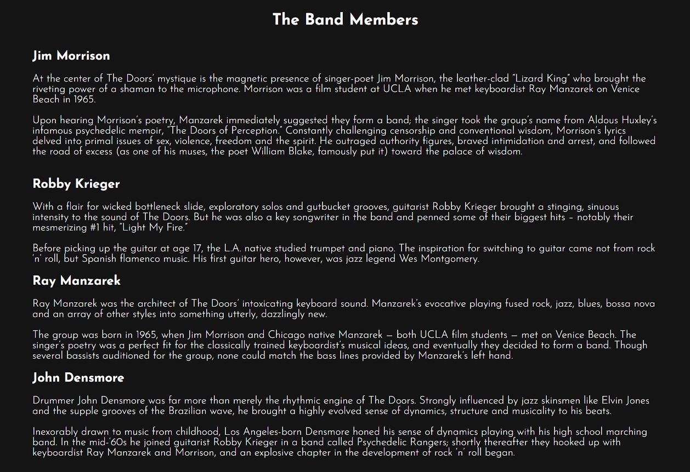
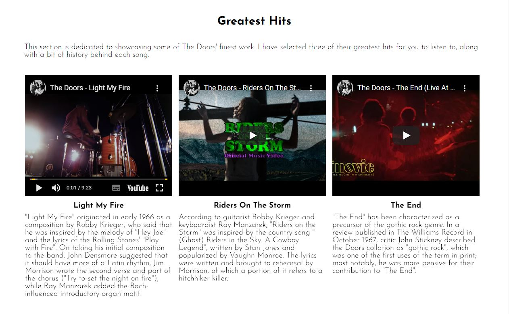
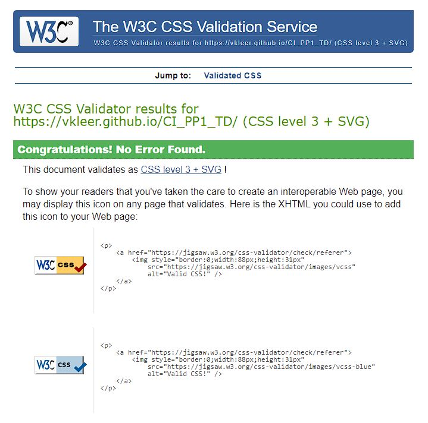
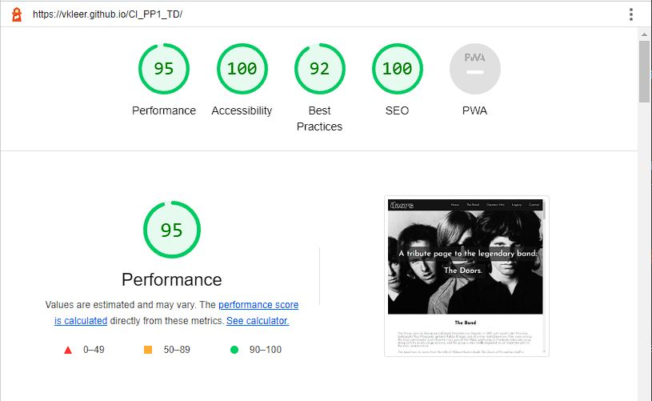

# The Doors
(Developer: Vilayat Kleer)

[View the live website](https://vkleer.github.io/CI_PP1_TD)

## Table of Contents

1. [Project Goals](#project-goals)
    1. [User Goals](#user-goals)
    2. [Website Owner Goals](#site-owner-goals)
2. [User Experience](#user-experience)
    1. [Target Audience](#target-audience)
    2. [User Requirements and Expectations](#user-requirements-and-expectations)
    3. [User Stories](#user-stories)
3. [Design](#design)
    1. [Design Choices](#design-choices)
    2. [Colour](#colour)
    3. [Fonts](#fonts)
    4. [Structure](#structure)
    5. [Wireframes](#wireframes)
4. [Technologies Used](#technologies-used)
    1. [Languages](#languages)
    2. [Tools](#tools)
5. [Features](#features)
    1. [Logo and Navigation bar](#logo-and-navigation-bar)
    2. [Hero Image](#hero-image)
    3. [Parallax Images](#parallax-images)
    4. [The Band](#the-band)
    5. [The Band Member Images](#the-band-member-images)
    6. [The Band Members](#the-band-members)
    7. [Greatest Hits](#greatest-hits)
    8. [Discover More Music](#discover-more-music)
    9. [Legacy](#legacy)
    10. [Contact](#contact)
    11. [The Doors Office and Recording Studio](#the-doors-office-and-recording-studio)
    12. [Footer](#footer)
    13. [404 Error Page](#404-error-page)
6. [Testing](#validation)
    1. [HTML Validation](#html-validation)
    2. [CSS Validation](#css-validation)
    3. [Accessibility](#accessibility)
    4. [Performance](#performance)
    5. [Testing on Different Devices](#testing-on-different-devices)
    6. [Browser Compatibility](#browser-compatibility)
    7. [Testing User Stories](#testing-user-stories)
8. [Bugs](#Bugs)
9. [Deployment](#deployment)
10. [Credits](#credits)
11. [Acknowledgements](#acknowledgements)

## Project Goals

### User Goals
- Find information about The Doors
- Find information about the band members
- Watch videos from The Doors
- Listen to music from The Doors

### Website Owner Goals
- Provide essential information about The Doors
- Promote The Doors’ music
- Provide an intuitive and responsive experience
- Provide users with a means of contacting website owner

## User Experience

### Target Audience
- People interested in The Doors
- The Doors tribute bands
- Music enthusiasts

### User Requirements and Expectations
- Structured website with clear sections
- Finding relevant information quickly
- Visually appealing and responsive website, no matter the device
- A way to contact the website owner
- Accessibility and readability

### User Stories

#### User
1. As a user, I want to learn what The Doors achieved as a band.
2. As a user, I want to learn who the band members are
3. As a user, I want to find out more about The Doors' music
4. As a user, I want to have control over the video and audio.
5. As a user, I want to easily find The Doors’ Spotify content
6. As a user, I want to learn about The Doors’ legacy
7. As a user, I want to know where The Doors recorded their music
8. As a user, I want to be able to contact the website owner
9. As a user, I want to know The Doors social media accounts so I can follow them.

#### Website owner
10. As the website owner, I want the purpose of the website to be clear immediately
11. As the website owner, I want to provide a responsive website for all devices.
12. As the website owner, I want users to be able to contact me for questions or suggestions
13. As the website owner, I want users to be able to go to any section of the page easily, no matter where they are
14. As the website owner, I want to embed API’s to enhance the user experience
15. As the website owner, I want to encourage users to explore The Doors’ music

## Design

### Design Choices
The website was designed to make learning about The Doors fun. A history website can easily become boring with walls of text - which is why I condensed all the core information and used a lot of imagery to go with the text. I made it a one-pager to make the website a journey, encouraging users to keep scrolling and learn more.

### Colour
The Doors are a band from the 60's and a majority of their visual content is in black and white, which is why I decided to use a grayscale theme. If a section requires a sub-section, I give them contrasting background colours - the main section gets a white background and the sub-section gets a black background.

### Fonts
To compliment the simplicity of the design I used only one font, with different font-weights: Josefin Sans, with a sans-serif fallback. The font is easy to read was designed to have a vintage feel.

Font Example

Font Description

### Structure
The website is structured in an intuitive way, using common web design conventions. The navigation bar is sticky with a logo on the left and the links to the right. Since it's a one-pager, it's important to have the navigation visible at all times. Headings are used hierarchically within their respective sections.
 
 
The content is split up into clear sections, divided by a parralax image to keep the design interesting. Each section is built with a different layout containing several elements.
 
 
The website consists of five main sections with four sub-sections:
- The 'Home' section, introducing users to the website with a hero image and headline, telling users what the website is about
- The 'The Band' section, covering The origin story
- The 'The Band Members' sub-section, containing a small biography for each band member
- The 'Greatest Hits' section, containing their greatest hits along with a short description
- The 'Discover More Music' sub-section, where a Spotify API is embedded to provide users with more songs to listen to
- The 'Legacy' section, informing users about The Doors' legacy
- The 'Legacy Events' section, covering three events that cemented The Doors' legacy
- The 'Contact' section where users can submit suggestions or questions 
- The 'The Doors Office and Recording Studio' section, where users can find the old office and recording studio location of The Doors

### Wireframes

Home/The Band

Greatest Hits

Legacy

Contact

## Technologies Used

### Languages
- HTML
- CSS

### Tools
- Gitpod
- Github
- Git
- Balsamiq
- Google Fonts
- Adobe Photoshop
- Adobe Illustrator
- Font Awesome
- https://grayscale.imageonline.co/
- https://favicon.io/

## Features
The website has a total of five sections and 13 features.

### Logo and Navigation bar
- The official The Doors logo is used and placed on the left as is conventional
- The navigation bar is sticky, meaning it will always be at the top of the page no matter how far you scroll down
- The navigation bar is responsive and works on all screen sizes - the menu turns into a mobile-friendly 'hamburger' menu on screens with a width of 850px and less
- Covers user story **8** and **13**

Screenshot of Logo and Navigation bar

    

### Hero Image
- Shows a picture of the band to introduce them to users
- Picture changes depending on screen size, making sure all band members fit in on any screen size
- Features the following text on top of the image to clearly state the purpose of the website: "A tribute page to the legendary band: The Doors"
- Covers user story **10**

Screenshot of Hero Image

    

### Parallax Images
- To divide the different sections on the website, multiple background images have been used to keep the design interesting
- The images move at a different speed than the rest of the content when scrolling, creating an aesthetically pleasing effect
- The hero image is also a parallax image

GIF of Parallax Images

    

### The Band
- Informs users about how and when the band came about
- Informs users about what set them apart from other bands at the time
- Informs users about the origin of the band name
- Contains images of each band member along with their name in a <figcaption>
- Images increase their size and become slightly transparent when hovered over
- Images take users to their corresponding short biographies if clicked on
- Covers user story **1**, **2** and **3**

Screenshot of The Band

    

### The Band Members
- Sub-section of 'The Band'
- Uses black background to contrast the main section
- Informs users the band members and their role in the band
- Covers user story **2**

Screenshot of The Band Members

    

### Greatest Hits
 - Introduces users to The Doors' greatest hits with three Youtube videos and accompanying descriptions
 - The videos are placed within <figure> elements and have use <figcaption>'s to semantically organize them
 - Covers user story **3**, **4** and **15**
 

Screenshot of Greatest Hits

    

 ### Discover More Music
 - Sub-section of 'Greatest Hits'
 - Uses black background to contrast the main section
 - Has the Spotify API embedded to encourage users to listen to more songs than just The Doors' greatest hits
 - The Spotify logo can be clicked to open Spotify and take users to The Doors' Spotify page
 - Covers user story **4**, **5**, **14** and **15**

Screenshot of Discover More Music

    

 ### Legacy
 - Introduces users to The Doors' legacy
 - Segue to the 'Legacy Events' section
 - Covers user story **6**

Screenshot of Legacy

    

 ### Legacy Events
 - Contains three notable events that contributed to The Doors' legacy
 - The three events have their own accompanying image and use a black background to contrast the main section
  - Covers user story **1** and **6**

Screenshot of Legacy Events

    

### Contact
- Provides users with a way to contact the website owner
- Covers user story **8** and **12**

Screenshot of Contact

    

### The Doors Office and Recording Studio
- Sub-section of 'Contact'
- Uses black background to contrast the main section
- Has the Google Maps API embedded to show The Doors' old office and recording studio location
- Covers user story **7**

Screenshot of The Doors Office and Recording Studio

    

### Footer
- At the bottom of the page as is conventional, using the same color as the nagivation bar for consistency
- Contains social media links to The Doors' social media pages, with corresponding icons
- Covers user story **9**

Screenshot of Footer

    

### 404 Error Page
- Displays a custom 404 error page, keeping the user in the flow of the website
- Provides a means for the user to easily return to the main website

Screenshot of 404 Error Page

    

## Testing

### HTML Validation
The HTML of the website has been validated using W3C's Markup Validation Service. Both of the pages pass with no errors or warnings.

Screenshot of index page HTML validation

    

Screenshot of 404 page HTML validation

    

### CSS Validation
The CSS of the website has been validatus using W3C's CSS Validation Service. It passed with no errors or warnings.

Screenshot of CSS validation

    

### Accessibility
The accessibility of the website has been measured using the Wave WebAIM web accessibility evaluation tool. Both of the pages pass with no errors.

Screenshot of index page accessibility evaluation

    

Screenshot of 404 page accessibility evaluation

    

### Performance
The performance of the website has been measured with Google Lighthouse. 

Screenshot of index page accessibility evaluation

For my index page, the 'Best Practices' score of 92 can unfortunately not be increased - the Youtube videos I embedded on my website have a SameSite error, which has to be fixed on Youtube's end.
    

Screenshot of 404 page accessibility evaluation

    

### Testing on Different Devices
The website has been tested on multiple physical devices without any issues:

- Desktop PC
- MacBook Pro 15"
- Google Pixel 6 Pro
- Samsung Galaxy S10
- Samsung Galaxy Note 10+

In addition to the physical devices, the website has also been tested without any issues by toggling all the different device options in Google Chrome's Developer Tools under the Device Toggling section.

### Browser Compatibility
The website has been tested without any issues on the four browsers with the largest userbase (as reported on https://gs.statcounter.com/browser-market-share):
- Google Chrome
- Safari
- Microsoft Edge
- Mozilla Firefox

### Testing User Stories
1. As a user, I want to learn what The Doors achieved as a band.

| **Feature** | **Action** | **Expected Result** | **Actual Result** |
|-------------|------------|---------------------|-------------------|
| The Band | Navigate to the 'The Band' section | Find information about the band | Works as expected |

Supporting Screenshots - User Story 1

2. As a user, I want to learn who the band members are

| **Feature** | **Action** | **Expected Result** | **Actual Result** |
|-------------|------------|---------------------|-------------------|
| The Band Members | Navigate to 'The Band' section and scroll down to 'The Band Members' sub-section | Find information about the band members | Works as expected |

Supporting Screenshots - User Story 2

3. As a user, I want to find out more about The Doors' music

| **Feature** | **Action** | **Expected Result** | **Actual Result** |
|-------------|------------|---------------------|-------------------|
| Greatest Hits | Navigate to the 'Greatest Hits' section | Find information about The Doors' songs | Works as expected |

Supporting Screenshots - User Story 3

4. As a user, I want to have control over the video and audio.

| **Feature** | **Action** | **Expected Result** | **Actual Result** |
|-------------|------------|---------------------|-------------------|
| Greatest Hits | Navigate to the 'Greatest Hits' section | Be able to watch videos that I can pause, change volume and put on fullscreen | Works as expected |
| Discover More Music | Navigate to 'Greatest Hits' section and scroll down to 'Discover More Music' sub-section | Be able to listen to songs that I can pick, pause and change volume | Works as intended |

Supporting Screenshots - User Story 4

5. As a user, I want to easily find The Doors’ Spotify content

| **Feature** | **Action** | **Expected Result** | **Actual Result** |
|-------------|------------|---------------------|-------------------|
| Discover More Music | Navigate to the 'Greatest Hits' section and scroll down to 'Discover More Music' sub-section | Be able to find The Doors' Spotify page | Works as intended |
| Footer | Navigate to the footer | Be able to find The Doors' Spotify page | Works as intended |

Supporting Screenshots - User Story 5

6. As a user, I want to learn about The Doors’ legacy

| **Feature** | **Action** | **Expected Result** | **Actual Result** |
|-------------|------------|---------------------|-------------------|
| Legacy | Navigate to the 'Legacy' section | Find information about The Doors' legacy | Works as intended |

Supporting Screenshots - User Story 6

7. As a user, I want to know where The Doors recorded their music

| **Feature** | **Action** | **Expected Result** | **Actual Result** |
|-------------|------------|---------------------|-------------------|
| The Doors Office and Recording Studio | Navigate to 'Contact' section and scroll down to 'The Doors Office and Recording Studio' sub-section | Find out where The Doors recorded their music | Works as intended |

Supporting Screenshots - User Story 7

8. As a user, I want to be able to contact the website owner

| **Feature** | **Action** | **Expected Result** | **Actual Result** |
|-------------|------------|---------------------|-------------------|
| Contact | Navigate to the 'Contact' section | Be able to send a message to the website owner | Works as intended |

Supporting Screenshots - User Story 8

9. As a user, I want to know The Doors social media accounts so I can follow them.

| **Feature** | **Action** | **Expected Result** | **Actual Result** |
|-------------|------------|---------------------|-------------------|
| Footer | Navigate to the footer | Find social media links | Works as intended |

Supporting Screenshots - User Story 9

10. As the website owner, I want the purpose of the website to be clear immediately

| **Feature** | **Action** | **Expected Result** | **Actual Result** |
|-------------|------------|---------------------|-------------------|
| Hero Image | Navigate to the 'Home' section | Find out what the website is about | Works as intended |

Supporting Screenshots - User Story 10

11. As the website owner, I want to provide a responsive website for all devices.

| **Feature** | **Action** | **Expected Result** | **Actual Result** |
|-------------|------------|---------------------|-------------------|
| The entire website | Open website on different devices | The website works on any device | Works as intended |

Supporting Screenshots - User Story 11

12. As the website owner, I want users to be able to contact me for questions or suggestions

| **Feature** | **Action** | **Expected Result** | **Actual Result** |
|-------------|------------|---------------------|-------------------|
| Contact | Navigate to the 'Contact' section | Be able to send a message to the website owner | Works as intended |

Supporting Screenshots - User Story 12

13. As the website owner, I want users to be able to go to any section of the page easily, no matter where they are

| **Feature** | **Action** | **Expected Result** | **Actual Result** |
|-------------|------------|---------------------|-------------------|
| Navigation Bar | Use the navigation bar | Be taken to the section I click on in the navigation bar | Works as intended |

Supporting Screenshots - User Story 13

14. As the website owner, I want to embed API’s to enhance the user experience

| **Feature** | **Action** | **Expected Result** | **Actual Result** |
|-------------|------------|---------------------|-------------------|
| Spotify API | Navigate to the 'Greatest Hits' section and scroll down to 'Discover More Music' sub-section | Find an embedded API | Works as intended |
| Google Maps API | Navigate to 'Contact' section and scroll down to 'The Doors Office and Recording Studio' sub-section | Find an embedded API | Works as expected |

Supporting Screenshots - User Story 14

15. As the website owner, I want to encourage users to explore The Doors’ music

| **Feature** | **Action** | **Expected Result** | **Actual Result** |
|-------------|------------|---------------------|-------------------|
| Greatest Hits | Navigate to the 'Greatest Hits' section | Provide users with The Doors' greatest hits | Works as expected |
| Discover More Music | Navigate to the 'Greatest Hits' section and scroll down to 'Discover More Music' sub-section | Provide users with more music to listen to + a link to their Spotify page | Works as expected |
| Footer | Navigate to the footer | Provide users another link to The Door's Spotify page | Works as intended |

Supporting Screenshots - User Story 15

## Bugs

| **Bug** | **Fix** |
|-------------|------------|
| Sticky navigation bar overlaps in-page anchors when using navigation menu  | Add scroll-padding-top property and set value equal to navigation bar height - [commit link](https://github.com/vkleer/CI_PP1_TD/commit/6be27546209a56bb85cee5504f16fdaca53e3b3b) |
| On smaller screens the website would show a horizontal scroll bar with empty content being displayed on the right | Add overflow-x property and set value to hidden - [commit link](https://github.com/vkleer/CI_PP1_TD/commit/c1b5ba906ef1153820b5eb003092dde235bac0f3) |
| Footer was not on the bottom of the 404 page due to lack of content | Add position property and set the value to absolute, then add bottom property and set the value to 0 - [commit link](https://github.com/vkleer/CI_PP1_TD/commit/562190a30f4584cb093bb9e1c2bfd956e3d28846) |
| 404 page would not display any style | Change permalink from /404.html to 404.html due to my folder structure - [commit link](https://github.com/vkleer/CI_PP1_TD/commit/964332ac68d471fd66608cfc452a25efe17d8ce7) |

## Deployment

This website was deployed using Github Pages with the following steps:

1. Go to your Github Repository
2. Navigate to the 'Settings' page
3. On the left hand menu under 'Code and automationo', click on 'Pages'
4. Under 'Source', click on the 'Branch' dropdown element and set it to your main branch (in my case, this branch is called 'main')
5. Click on 'Save'
6. Refresh the page and you will be provided with a link to your deployed Github Page.

If you want to fork this repository, follow these steps:

1. Go to the Github repository (https://github.com/vkleer/CI_PP1_TD)
2. Click on the 'Fork' button in the top right corner under the navigation bar

If you want to clone this repository, follow these steps:

1. Go to the Github repository (https://github.com/vkleer/CI_PP1_TD)
2. Click on the 'Code' button above the list of files
3. Select your preferred way of cloning, I recommend using the 'GitHub CLI' option
4. Under 'GitHub CLI', click on the copy button to copy the clone command
5. In you IDE, open Git Bash
6. Navigate to the working directory where you want to clone this directory
7. Paste in the clone command you copied and press the 'enter' key to create the clone

## Credits
Images that are not referenced below are created or owned by the developer.

### Images
- [hero-image.webp](assets/images/hero-image.webp) from [Mubi.com](https://mubi.com/de/films/when-youre-strange-a-film-about-the-doors)
- [hero-image-tablet.jpg](assets/images/hero-image-tablet.jpg) from [Laut.de](https://www.laut.de/The-Doors)
- [hero-image-mobile.jpg](assets/images/hero-image-mobile.jpg) from [The Doors official Youtube channel](https://www.youtube.com/user/thedoors)
- [bio-jim-morrison.png](assets/images/bio-jim-morrison.png) from [The Doors' official website](https://thedoors.com/the-band)
- [bio-john-densmore.png](assets/images/bio-john-densmore.png) from [The Doors' official website](https://thedoors.com/the-band)
- [bio-ray-manzarek.png](assets/images/bio-ray-manzarek.png) from [The Doors' official website](https://thedoors.com/the-band)
- [bio-robbie-krieger.png](assets/images/bio-robbie-krieger.png) from [The Doors' official website](https://thedoors.com/the-band)
- [greatest-hits-image.jpg](assets/images/greatest-hits-image.jpg) from Twitter user [@crockpics](https://twitter.com/crockpics/status/1128108068989034496/photo/1) from [The Doors' official website](https://thedoors.com/the-band)
- [legacy-image.jpg](assets/images/legacy-image.jpg) from Tumblr user [frxzentears](https://frxzentears.tumblr.com/)
- [legacy-image-tablet.jpg](assets/images/legacy-image.jpg) from Tumblr user [frxzentears](https://frxzentears.tumblr.com/) - I increased the image height in Adobe Photoshop to better fit smaller screens
- [american-prayer](assets/images/american-prayer.jpg) from [Amazon.de](https://www.amazon.de/American-Prayer-Jim-Morrison/dp/B000002HJD)
- [alive-she-cried.jpg](assets/images/alive-she-cried.jpg) from [Wikipedia](https://en.wikipedia.org/wiki/Alive,_She_Cried#/media/File:TheDoorsAliveSheCriedalbumcover.jpg)
- [doors-movie.jpg](assets/images/doors-movie.jpg) from [IMDB](https://www.imdb.com/title/tt0101761/)
- [contact-image.jpg](assets/images/contact-image.jpg) by [Craig Baker](https://historicalmarkerproject.com/users/2713/craig-baker) from [The Historical Marker Database](https://www.hmdb.org/m.asp?m=183145)
- [contact-image-tablet.jpg](assets/images/contact-image-tablet.jpg) by [Craig Baker](https://historicalmarkerproject.com/users/2713/craig-baker) from [The Historical Marker Database](https://www.hmdb.org/m.asp?m=183145) - I increased the image height in Adobe Photoshop to better fit smaller screens
- [the-doors-logo-white.png](assets/images/the-doors-logo-white.png) from [Wikipedia](https://commons.wikimedia.org/wiki/File:The_Doors_Logo.png) - I turned the logo white using Adobe Photoshop
- [favicon.ico](assets/images/favicon.ico) by [Joel Brodsky](https://www.holdenluntz.com/artists/joel-brodsky/) from [Holden Luntz Gallery](https://www.holdenluntz.com/artists/joel-brodsky/jim-morrison/) - I cropped the image using Adobe Photoshop and used [favicon.io](https://favicon.io/) to turn it into an .ico file

### Text
- The text that I used in the 'The Band' section comes from [The Doors' Wikipedia page](https://en.wikipedia.org/wiki/The_Doors)
- The text that I used in the 'The Band Members' section comes from [The Official The Doors' website](https://thedoors.com/the-band)
- The song descriptions on the 'Greatest Hits' section are snippets from their respective Wikipedia pages - [Light My Fire](https://en.wikipedia.org/wiki/Light_My_Fire), [Riders on the Storm](https://en.wikipedia.org/wiki/Riders_on_the_Storm) and [The End](https://en.wikipedia.org/wiki/The_End_(The_Doors_song))
- The text that I used in the 'Legacy' section comes from a [Rolling Stones article](https://www.rollingstone.com/music/music-news/the-legacy-of-jim-morrison-and-the-doors-173068/) by [Mikal Gilmore](https://www.rollingstone.com/author/mikal-gilmore/)
- The event descriptions on the 'Legacy Events' section come from [The Doors' Wikipedia page](https://en.wikipedia.org/wiki/The_Doors#Legacy)

### Code
- The HTML and CSS for the responsive navigation bar was inspired (not copy and pasted) by [a Medium article](https://medium.com/@lizfaria/create-a-responsive-dropdown-menu-in-html-css-in-ten-steps-fdb4aa906978) from [Liz Faria](https://medium.com/@lizfaria)
- The solution to my sticky navigation bar overlapping my in-page headers was found on [Stack Overflow](https://stackoverflow.com/questions/4086107/fixed-page-header-overlaps-in-page-anchors) and posted by [Adrian Garner](https://stackoverflow.com/users/573373/adrian-garner)

## Acknowledgements
I would like to thank:
- The Doors and all individual band members for inspiring me in many ways, including creating this website
- My mentor Mo Shami for providing me with advice and guidance for this project

